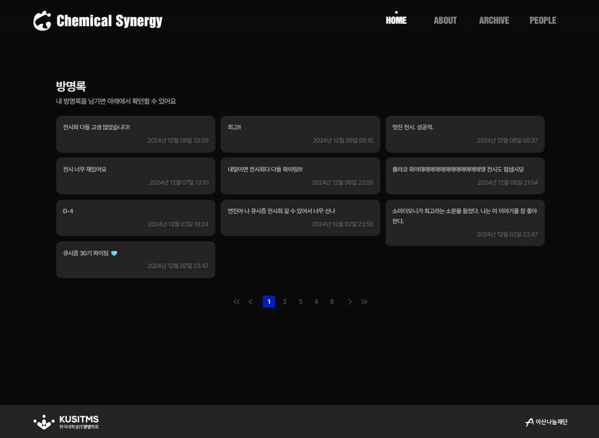

# Chemical Synergy

  

> Chemical Synergiy - 한국대학생IT경영학회 KUSITMS 2회 전시회 사이트  
> 개발 기간 : 2024.11.04 ~ 12.01  
> 배포 주소 : https://www.chemical-synergy-with-kusitms.com

 

## ✅ 프로젝트 소개

Chemical Synergy는 한국대학생IT경영학회 KUSITMS의 2번째 전시회의 타이틀입니다. 큐시즘에서는 기획, 개발, 디자인, 세 파트가 모여 하나의 서비스를 만들어냅니다. 각 파트의 강점과 한계를 채우는 협업의 과정이 마치 고유한 화학물질이 결합하여 다른 물질로 변화하는 화학반응과 유사해 Chemical Synergy로 이름지었습니다. 그리고 전시회에 참여하는 팀들의 프로젝트와 참여자들을 소개하고자 사이트를 만들게 되었습니다. 반응형 웹 디자인을 통해 다양한 디바이스에서 원활히 접속할 수 있도록 작업했습니다.

 

## ✅ 멤버 구성

|                                   프론트엔드                                    |                                      백엔드                                      |
| :-----------------------------------------------------------------------------: | :------------------------------------------------------------------------------: |
|                      [안민하](https://github.com/AAminha)                       |                      [한상호](https://github.com/bbbang105)                      |
|  |  |

 

## ✅ 기술 스택

### Environment

&nbsp;

&nbsp;

### Config

### Development

&nbsp;

&nbsp;

&nbsp;

&nbsp;

&nbsp;

### Communication & Docs

&nbsp;

 

## ✅ 주요 기능

### ✨ 전시회 소개

- 전시회의 비주얼 아이덴티티를 소개합니다.
- 전시회의 내부 구조를 지도와 함께 소개합니다.
- 전시회에서 진행되는 프로그램을 소개합니다.

### ✨ 방명록 작성 및 조회 기능

- 전시회 전체, 전시회 참여팀에게 방명록을 작성할 수 있습니다.
- 작성된 방명록을 조회할 수 있습니다.

### ✨ 전시회 참여팀 및 참여자 소개

- 전시회에 참여하는 OB, YB가 만든 서비스를 소개합니다.
- 전시회에 참여하는 외부 단체의 서비스를 소개합니다.
- 전시회에 참여하는 참여자들을 소개합니다.

 

## ✅ Microsoft Clarity

<table>
  <tr>
    <td width="50%"></td>
    <td width="50%"></td>
  </tr>
  <tr>
    <td width="50%">전시회 사이트가 공개된 11월 25일부터 12월 말까지 총 1,101명의 고유 사용자가 접속하였습니다.</td>
    <td width="50%">접속 유저의 약 73.95%가 모바일 기기를 사용했으며, 모바일 사용자를 주요 타겟으로 삼아 진행한 반응형 작업이 전략적으로 성공을 거두었습니다.</td>
  </tr>
</table>

 

## ✅ 시스템 아키텍처

 

## ✅ 화면 구성

<table>
  <tr>
      <th width="50%" style="text-align:center;">Home - 메인 그래픽</th>
      <th width="50%" style="text-align:center;">Home - 방명록 작성 모달창</th>
  </tr>
  <tr>
    <td width="50%"></td>
    <td width="50%"></td>
  </tr>
  <tr>
      <th width="50%" style="text-align:center;">Home - 전시회 아이덴티티</th>
      <th width="50%" style="text-align:center;">Home - 방명록 조회 & 푸터</th>
  </tr>
  <tr>
    <td width="50%"></td>
    <td width="50%"></td>
  </tr>
  <tr>
      <th width="50%" style="text-align:center;">About - 전시회 비주얼 아이덴티티</th>
      <th width="50%" style="text-align:center;">About - 전시회 정보</th>
  </tr>
  <tr>
    <td width="50%"></td>
    <td width="50%"></td>
  </tr>
  <tr>
      <th width="50%" style="text-align:center;">About - 프로그램</th>
      <th width="50%" style="text-align:center;"></th>
  </tr>
  <tr>
    <td width="50%"></td>
    <td width="50%"></td>
  </tr>
  <tr>
      <th width="50%" style="text-align:center;">Archive - 전시회 참여팀 서비스 목록</th>
      <th width="50%" style="text-align:center;">Archive - 서비스 소개</th>
  </tr>
  <tr>
    <td width="50%"></td>
    <td width="50%"></td>
  </tr>
  <tr>
      <th width="50%" style="text-align:center;">Archive - 팀원 및 각 팀 방명록 조회</th>
      <th width="50%" style="text-align:center;">People - 전시회 참여자 및 외부 부스 소개</th>
  </tr>
  <tr>
    <td width="50%"></td>
    <td width="50%"></td>
  </tr>
</table>
